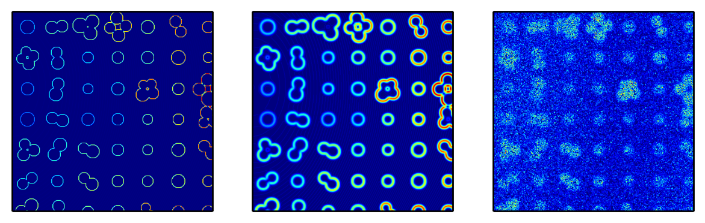

WELCOME
********

Supplement materials to PeerJ Preprint: `A workflow for characterizing nanoparticle monolayers for biosensors: Machine learning on real and artificial SEM images`_

.. _`A workflow for characterizing nanoparticle monolayers for biosensors: Machine learning on real and artificial SEM images` : https://peerj.com/preprints/671v1/

Artificial/Test Images
======================

**Version 1** (`go to folder`_):

 - test images were generated in an IPython notebook on 2/26/14, which can be downloaded `here`_, or can be viewed directly in the `browser here`_.

**Re-running notebook will result in different images** due to the inherent random sampling.

.. _`here`: https://github.com/hugadams/pyparty/blob/master/examples/Notebooks/test_data_V1.ipynb
.. _`browser here`: http://nbviewer.ipython.org/github/hugadams/pyparty/blob/master/examples/Notebooks/test_data_V1.ipynb?create=1
.. _`go to folder` : https://github.com/hugadams/imgproc_supplemental/tree/master/images/Test_Data/Version1

IPython_ Notebooks
==================

.. _`IPython` : http://ipython.org/notebook.html

1. `Generating Test Images`_
2. `Measuring Digitization Errors in Small Particles`_ 
3. `Quantifying Segmentation In Binary Images`_
4. `Thresholding, Edge, and Seeded Segmentation`_
5. `Denoising and Filtering`_
6. `Contrast Enhancement`_  
7. `Intro to Particle Classification`_
8. `Segmentation Error in Ilastik`_
9. `Classifying Nanoparticles: Ilastik vs. User Partitioning`_
10. `Fourier Filtering of Noisy Test Image`_

Extra
-----
- `Creating Pie Chart in Fig 12 D`_

.. _`Generating Test Images`: http://nbviewer.ipython.org/github/hugadams/pyparty/blob/master/examples/Notebooks/test_data_V1.ipynb?create=1
.. _`Measuring Digitization Errors in Small Particles`: http://nbviewer.ipython.org/github/hugadams/imgproc_supplemental/blob/master/Notebooks/digitization.ipynb?create=1
.. _`Quantifying Segmentation In Binary Images`: http://nbviewer.ipython.org/github/hugadams/imgproc_supplemental/blob/master/Notebooks/quantify_segment.ipynb?create=1
.. _`Thresholding, Edge, and Seeded Segmentation` : http://nbviewer.ipython.org/github/hugadams/imgproc_supplemental/blob/master/Notebooks/thresholding.ipynb?create=1
.. _`Denoising and Filtering` : http://nbviewer.ipython.org/github/hugadams/imgproc_supplemental/blob/master/Notebooks/preprocessing.ipynb?create=1
.. _`Contrast Enhancement` : http://nbviewer.ipython.org/github/hugadams/imgproc_supplemental/blob/master/Notebooks/histogram_equilization.ipynb?create=1
.. _`Intro to Particle Classification`: http://nbviewer.ipython.org/github/hugadams/imgproc_supplemental/blob/master/Notebooks/usermodel.ipynb?create=1
.. _`Segmentation Error in Ilastik`: http://nbviewer.ipython.org/github/hugadams/imgproc_supplemental/blob/master/Notebooks/ilastik_segmentation.ipynb
.. _`Classifying Nanoparticles: Ilastik vs. User Partitioning`: http://nbviewer.ipython.org/github/hugadams/imgproc_supplemental/blob/master/Notebooks/user_classifier.ipynb?create=1
.. _`Fourier Filtering of Noisy Test Image` : http://nbviewer.ipython.org/github/hugadams/imgproc_supplemental/blob/master/Notebooks/fourier.ipynb?create=1
.. _`Creating Pie Chart in Fig 12 D` : http://nbviewer.ipython.org/github/hugadams/imgproc_supplemental/blob/master/Notebooks/PIECHART.ipynb?create=1

Additional Images and Videos
============================

Videos
------

- `Nanoparticle aggregation segmentation and classification in Ilastik`_

.. _`Nanoparticle aggregation segmentation and classification in Ilastik` : https://www.youtube.com/watch?v=YzylgLw4iTA`

SEM Images
----------

- `Check out the folder`_

These are various SEM gold nanoparticle images taken at GWU by Adam Hughes and Evelyn Liu in Mark Reeves Lab.  They contain clear images, as 
well as examples of low contrast, contrast gradients, noise, thermal drift and other artifcats.  The images were taken at 30000, 50000 and 100000
magnificiation. Nanoparticles are roughly 22nm in diameter.

.. _`Check out the folder` : https://github.com/hugadams/imgproc_supplemental/tree/master/supplemental/SEM_Example_Images

Contamination Examples
----------------------

Check out the `contamination folder`_ or corresponding `contamination collage`_.

.. _`contamination folder` : https://github.com/hugadams/imgproc_supplemental/tree/master/supplemental/Contamination
.. _`contamination collage` : https://github.com/hugadams/imgproc_supplemental/blob/master/supplemental/Contamination/contam_collage.png

Thresholding
------------

Fiji/ImageJ Autothresholding plugins
....................................

We used an SEM image with a contrast gradient (`view here`_) and tested 9 local and 16 global thresholding algorithms built into the
Fiji `autothresholding plugin`_.  Check out the results below:

   - `16 global threshold collage.png`_
   - `9 local threshold collage.png`_

Based on these results, we pared down the best segmentation candidates to use on our test images as described in the paper.

.. _`view here` : https://github.com/hugadams/imgproc_supplemental/blob/master/supplemental/contrast_slow_vary.tif
.. _`autothresholding plugin` : http://fiji.sc/wiki/index.php/Auto_Local_Threshold
.. _`16 global threshold collage.png` : https://github.com/hugadams/imgproc_supplemental/blob/master/supplemental/Fiji_ImageJ/Results/autoglobalthresh.png
.. _`9 local threshold collage.png` : https://github.com/hugadams/imgproc_supplemental/blob/master/supplemental/Fiji_ImageJ/Results/autolocalthresh.png

Scikit-Image in-depth results
.............................

An in-depth analysis for the segmentation techniques applied on the test images (does not include Ilastik semi-supervised semi-supervised segmentation)
is presented in the `Classifying Nanoparticles: Ilastik vs. User Partitioning`_ notebook.  Check out
the `scikit thresholding collage`_, which shows all of these results in one image, or view the images separately in `this folder`_.
 
.. _`scikit thresholding collage` : https://github.com/hugadams/imgproc_supplemental/blob/master/supplemental/Threshold_collage/collage_plot.png
.. _`this folder` : https://github.com/hugadams/imgproc_supplemental/tree/master/supplemental/Threshold_collage

Paper Figures
=============

Full size versions of the figures appearing in the paper are available in the `Paper Images folder`_.

.. _`Paper Images folder` : https://github.com/hugadams/imgproc_supplemental/tree/master/Paper_Images

Example Fig 1
-------------

.. image:: Paper_Images/Figure8a.png

Example Fig 2
-------------

