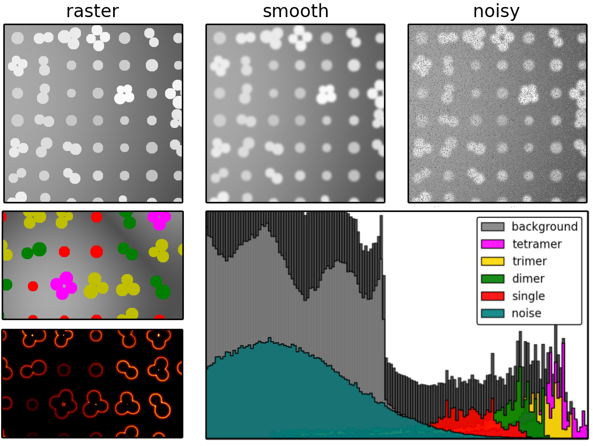

WELCOME
********

Supplemental materials including ipython notebook examples to supplement image processing journals.

Test Images
===========

**Version 1** (`go to folder`_):

 - test images were generated in an IPython notebook on 2/26/14, which can be downloaded `here`_, or can be viewed directly in the `browser here`_.

**Re-running notebook will result in different images** due to the inherent random sampling.

.. _`here`: https://github.com/hugadams/pyparty/blob/master/examples/Notebooks/test_data_V1.ipynb
.. _`browser here`: http://nbviewer.ipython.org/github/hugadams/pyparty/blob/master/examples/Notebooks/test_data_V1.ipynb?create=1
.. _`go to folder` : https://github.com/hugadams/imgproc_supplemental/tree/master/images/Test_Data/Version1

IPython_ Notebooks
==================

.. _`IPython` : http://ipython.org/notebook.html

1. `Measuring Digitization Errors in Small Particles`_ 
2. `Quantifying Segmentation Errors Between Two Binary Images`_
3. `Comparison of Segmentation Algorithm Performance on Test Images`_
4. `Denoising and Filtering`_
5. `Contrast Equilization`_  
6. `Introduction to User-defined Labels`_
7. `Test Data Characterization`_
8. `AuNP Species Partitions: Ilastik vs. User-defined Labels`_
9. `Fourier Filtering of Noisy Test Image`_

.. _`Measuring Digitization Errors in Small Particles`: http://nbviewer.ipython.org/github/hugadams/imgproc_supplemental/blob/master/Notebooks/digitization.ipynb?create=1
.. _`Quantifying Segmentation Errors Between Two Binary Images`: http://nbviewer.ipython.org/github/hugadams/imgproc_supplemental/blob/master/Notebooks/quantify_segment.ipynb?create=1
.. _`Comparison of Segmentation Algorithm Performance on Test Images` : http://nbviewer.ipython.org/github/hugadams/imgproc_supplemental/blob/master/Notebooks/thresholding.ipynb?create=1
.. _`Denoising and Filtering` : http://nbviewer.ipython.org/github/hugadams/imgproc_supplemental/blob/master/Notebooks/preprocessing.ipynb?create=1
.. _`Contrast Equilization` : http://nbviewer.ipython.org/github/hugadams/imgproc_supplemental/blob/master/Notebooks/histogram_equilization.ipynb?create=1
.. _`Introduction to User-defined Labels`: http://nbviewer.ipython.org/github/hugadams/imgproc_supplemental/blob/master/Notebooks/usermodel.ipynb?create=1
.. _`Test Data Characterization`: http://nbviewer.ipython.org/github/EvelynLiu77/GWU_nb_shared/blob/evelyn/Ilastik_object_class_error.ipynb?create=1
.. _`AuNP Species Partitions: Ilastik vs. User-defined Labels`: http://nbviewer.ipython.org/github/hugadams/imgproc_supplemental/blob/master/Notebooks/user_classifier.ipynb?create=1
.. _`Fourier Filtering of Noisy Test Image` : http://nbviewer.ipython.org/github/hugadams/imgproc_supplemental/blob/master/Notebooks/fourier.ipynb?create=1

Supplemental
============

Videos
------

- `Nanoparticle aggregation segmentation and classification in Ilastik`_

.. _`Nanoparticle aggregation segmentation and classification in Ilastik` : https://www.youtube.com/watch?v=YzylgLw4iTA`

Contamination Examples
----------------------

Check out the `contamination folder`_ or corresponding `contamination collage`_.

.. _`contamination folder` : https://github.com/hugadams/imgproc_supplemental/tree/master/supplemental/Contamination
.. _`contamination collage` : https://github.com/hugadams/imgproc_supplemental/blob/master/supplemental/Contamination/contam_collage.png

Thresholding
------------

Scikit-Image in-depth results
.............................

An in-depth analysis for the segmentation techniques applied on the test images (does not include Ilastik semi-supervised semi-supervised segmentation)
is presented in the `Test Data Characterization`_ notebook.  Check out
the `scikit thresholding collage`_, which shows all of these results in one image, or view the images separately in `this folder`_.
 
.. _`scikit thresholding collage` : https://github.com/hugadams/imgproc_supplemental/blob/master/supplemental/Threshold_collage/collage_plot.png
.. _`this folder` : https://github.com/hugadams/imgproc_supplemental/tree/master/supplemental/Threshold_collage

Fiji/ImageJ Autothresholding plugins
....................................

We used an SEM image with a contrast gradient (`view here`_) and tested 9 local and 16 global thresholding algorithms built into the
Fiji `autothresholding plugin`_.  Check out the results below:

   - `16 global threshold collage.png`_
   - `9 local threshold collage.png`_

.. _`view here` : https://github.com/hugadams/imgproc_supplemental/blob/master/supplemental/contrast_slow_vary.tif
.. _`autothresholding plugin` : http://fiji.sc/wiki/index.php/Auto_Local_Threshold
.. _`16 global threshold collage.png` : https://github.com/hugadams/imgproc_supplemental/blob/master/supplemental/Fiji_ImageJ/Results/autoglobalthresh.png
.. _`9 local threshold collage.png` : https://github.com/hugadams/imgproc_supplemental/blob/master/supplemental/Fiji_ImageJ/Results/autolocalthresh.png

**Imaging Processing of Nanoparticles: Part 2-- Characterization and Modeling**

- Singles, Dimers, Flats and Piles:
   - `Batch-to-batch variability report (pdf)`_ 
   - (clay nb1?) ``_
   - (clay nb2?) ``_
-
-

.. _`Batch-to-batch variability report (pdf)`: http://github.com/hugadams/imgproc_supplemental/blob/master/supplemental/Piles_Flats_ClayAnalysis/7_10_14_BATCHVARIETY.pdf

Figures
=======

Here are full-sized figures appearing in the manuscripts.  (Will be updated in full after acceptance of paper.)  Can host either
hyperlinks, or raw images which can be saved at full resolution by right-clicking and choosing "save as".

Example Fig 1
-------------

Example Fig 2
-------------

.. image:: images/collage_plot/basins.png

